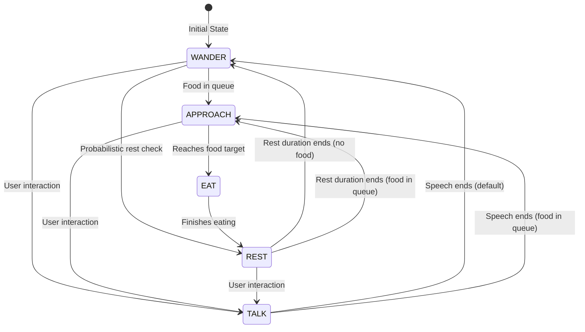
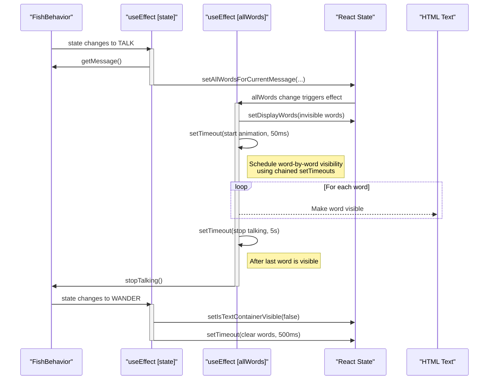

# Analysis of `Fish.tsx`

This document provides a detailed breakdown of the control flow and logic within the `Fish.tsx` component, augmented with verbatim code snippets.

This component is responsible for rendering and animating a "fish" creature in a 3D scene. It's a complex component that integrates state management, user interaction, animation, and external data fetching to create a dynamic and interactive agent.

---

### 1. Core Concepts & Structure

- **Entity-Component-System (ECS) like Pattern**: The component follows a pattern where the `Fish.tsx` file handles the "view" (rendering the Three.js objects) and animation loop, while the `FishBehavior.ts` class acts as a state machine or "controller" for the fish's autonomous behavior.

    ```typescript
    // src/components/Fish.tsx
    import { FishBehavior, FishState } from '../../steering/FishBehavior'
    // ...
    const fishBehavior = useMemo(() => new FishBehavior({
        // ...
    }), [/* ... */])
    ```

- **State Machine**: The fish's behavior is dictated by a state machine (`FishBehavior`) with states like `WANDER`, `APPROACH`, `EAT`, `REST`, and `TALK`. The main animation loop in `Fish.tsx` queries the current state and updates the fish's movement and appearance accordingly.

    ```typescript
    // src/FishBehavior.ts
    export enum FishState {
      WANDER = "wander",
      APPROACH = "approach",
      EAT = "eat",
      REST = "rest",
      TALK = "talk",
    }
    ```

- **Real-time Animation**: The `useFrame` hook from `@react-three/fiber` is the heart of the component, running on every rendered frame to update positions, animations, and behaviors.

    ```typescript
    // src/components/Fish.tsx
    import { useFrame, RootState } from '@react-three/fiber'
    // ...
    useFrame((state: RootState, delta: number) => {
      timeRef.current = state.clock.elapsedTime
      if (!headRef.current) return
    
      // ... animation logic ...
    })
    ```

- **User Interaction**: The fish can be interacted with in two main ways:
    1.  **Clicking the fish**: Triggers an AI interaction, fetching a response from an external service and making the fish "talk".
    2.  **Interacting with the ground plane**: "Feeds" the fish by creating food targets that it will then approach. This uses a sophisticated set of pointer events to handle single-clicks, double-clicks, and long-presses across desktop and mobile.

    ```typescript
    // src/components/Fish.tsx
    
    // Fish click handler
    const handleFishClick = useCallback(async (/* e: ThreeEvent<MouseEvent> */) => {
        // ...
    }, [/* ... */])
    
    // Ground plane for feeding
    <mesh
      onDoubleClick={(e) => {
        if (!isMobileDevice) {
          handleFeedFish(e.point)
        }
      }}
      // ... other pointer events
    >
      {/* ... */}
    </mesh>
    ```

- **Vector Pooling**: To optimize performance and reduce garbage collection pauses, the component uses a vector pool (`vectorPool`) to reuse `THREE.Vector3` objects for calculations within the animation loop.

    ```typescript
    // src/components/Fish.tsx
    const vectorPool = useMemo(() => {
        // Create a larger pool since Fish component uses many vectors
        const pool: THREE.Vector3[] = [];
        for (let i = 0; i < 50; i++) {
          pool.push(new THREE.Vector3());
        }
        
        // ...
        
        return {
          get: () => {
            if (pool.length === 0) {
              // ...
              return new THREE.Vector3();
            }
            return pool.pop()!;
          },
          release: (v: THREE.Vector3) => {
            if (pool.length < 100) { // Cap pool size
              v.set(0, 0, 0); // Reset vector
              pool.push(v);
            }
          },
          // ...
        };
      }, []);
    ```

---

### 2. State Management

The component uses a combination of `useState`, `useRef`, and `useMemo` to manage its state and resources efficiently.

#### **Refs (`useRef`)**
Refs are used extensively to hold values that can change over time without triggering a re-render. This is crucial for performance inside the `useFrame` loop.

```typescript
// src/components/Fish.tsx

// Object Refs
const headRef = useRef<THREE.Mesh>(null)
const arrowRef = useRef<THREE.ArrowHelper>(null)
const tailRefs = useRef<(THREE.Mesh | null)[]>([])

// Movement & Position Refs
const currentVelocity = useRef(new THREE.Vector3())
const wanderTargetRef = useRef(new THREE.Vector3())
const lastHeadDir = useRef(new THREE.Vector3(0, 0, 1))

// Animation & Timing Refs
const timeRef = useRef(0)
const lastWanderUpdateRef = useRef(0)
const activeRipples = useRef<ActiveRipple[]>([]);
const activePulseStartTimesRef = useRef<number[]>([]);
```

#### **State (`useState`)**
State is used for values that, when changed, should trigger a re-render of some part of the component.

```typescript
// src/components/Fish.tsx

// Debug state for current behavior
const [currentBehavior, setCurrentBehavior] = useState<FishState>(FishState.WANDER)

// Food target state
const [foodTarget, setFoodTarget] = useState<THREE.Vector3 | null>(null)

// Loading state for AI response
const [isLoading, setIsLoading] = useState(false)

// State for text display
const [allWordsForCurrentMessage, setAllWordsForCurrentMessage] = useState<string[]>([]);
const [displayWords, setDisplayWords] = useState<{ text: string; visible: boolean; position: number }[]>([]);
const [isTextContainerVisible, setIsTextContainerVisible] = useState(false);
```

#### **Memoization (`useMemo`, `useCallback`)**
- `gradientMap`: A `THREE.DataTexture` for toon shading is created only once.
- `fishBehavior`: The `FishBehavior` state machine instance is created only once.
- `vectorPool` and temporary vectors (`tempVec1`, etc.): The object pool and reusable vectors are initialized once to prevent re-creation on each render.
- `handleFishClick`: The primary interaction handler is wrapped in `useCallback` to maintain a stable reference, preventing unnecessary re-renders of child components or effects that depend on it.

```typescript
// src/components/Fish.tsx

// Memoized FishBehavior instance
const fishBehavior = useMemo(() => new FishBehavior({
  approachThreshold: wanderControls.arrivalDistance,
  // ... other options
}), [/* ... */])

// Memoized gradient map
const gradientMap = useMemo(() => {
  const colors = new Uint8Array([0, 80, 160, 255])
  const texture = new THREE.DataTexture(
    colors,
    colors.length,
    1,
    THREE.RedFormat
  )
  texture.needsUpdate = true
  return texture
}, [])

// Memoized click handler
const handleFishClick = useCallback(async (/* e: ThreeEvent<MouseEvent> */) => {
  // ... logic
}, [fishBehavior, me, generateResponse, setHeadSpring, resetForNewEntry])
```

---

### 3. Control Flow and Logic

#### **`FishBehavior` State Machine**
The core logic is driven by the state machine defined in `FishBehavior.ts`. User interactions and autonomous behaviors cause transitions between states.



The instance is created using `useMemo` to prevent re-creation on every render.

```typescript
// src/components/Fish.tsx

const fishBehavior = useMemo(() => new FishBehavior({
    approachThreshold: wanderControls.arrivalDistance,
    restDuration: 0.5, // This is post-eating rest duration
    eatDuration: 0.3,
    bounds: { min: boundaryControls.min, max: boundaryControls.max },
    onEat: () => {
      setFoodTarget(null)
      setTailCount((prev) => {
        if (prev == MAX_LENGTH) {
          return prev
        }
        return prev + 1
      })
    },
    restCheckInterval: probabilisticRestControls.restCheckInterval,
    minWanderRestDuration: probabilisticRestControls.minWanderRestDuration,
    maxWanderRestDuration: probabilisticRestControls.maxWanderRestDuration,
}), [wanderControls.arrivalDistance, boundaryControls.min, boundaryControls.max, probabilisticRestControls])
```

#### **`useFrame((state, delta))` - The Animation Loop**

This is the engine of the component. On every frame, it executes a precise sequence of operations.

```mermaid
graph TD
    A[useFrame(state, delta)] --> B{Update Behavior};
    B --> C{Update Movement};
    C --> D{Compute Orientation};
    D --> E{Update Tail};
    E --> F{Animate Effects};
    F --> G{Sync & Callbacks};
    G --> A;

    subgraph B[Update Behavior]
        B1[fishBehavior.update()]
    end

    subgraph C[Update Movement]
        C1[Reads fishBehavior.state]
        C2[Calculates new head position based on state]
    end

    subgraph D[Compute Orientation]
        D1[computeTargetDirection()]
        D2[Smooth direction with lerp]
    end

    subgraph E[Update Tail]
        E1[updateTailSegments()]
    end

    subgraph F[Animate Effects]
        F1[Ripples]
        F2[Pulses]
    end

    subgraph G[Sync & Callbacks]
        G1[Sync hitbox]
        G2[onPositionUpdate()]
    end
```

The core logic is contained within the `useFrame` hook.

```typescript
// src/components/Fish.tsx

useFrame((state: RootState, delta: number) => {
    timeRef.current = state.clock.elapsedTime
    const currentTime = state.clock.elapsedTime; // Use consistent clock time
    if (!headRef.current) return

    // 1. Update the fish behavior state machine
    fishBehavior.update(headRef.current.position, currentVelocity.current, delta)
    setCurrentBehavior(fishBehavior.state)

    // 2. Update movement (head position, steering, and velocity)
    updateMovement(delta)

    // 3. Compute a smoothed intended direction (to drive the tail)
    const newDirCandidate = computeTargetDirection()
    lastHeadDir.current.lerp(newDirCandidate, 0.5)
    const intendedDir = lastHeadDir.current.clone()

    // Update arrow helper (for debugging)
    if (arrowRef.current) {
      arrowRef.current.position.copy(headRef.current.position)
      arrowRef.current.setDirection(intendedDir)
    }

    // 4. Update tail segments so they follow the head smoothly
    updateTailSegments(intendedDir)

    // 5. Synchronize hitbox position with the head
    if (headRef.current && hitboxRef.current) {
      hitboxRef.current.position.copy(headRef.current.position);
    }
    
    // ... (other logic: perspective line, callbacks, ripples, pulses) ...
})
```

**Movement Logic (`updateMovement`)**

```typescript
// src/components/Fish.tsx

const updateMovement = (delta: number) => {
    const params = wanderParams.current;
    // Use tempVec1 instead of clone for priorPos
    tempVec1.copy(headRef.current!.position);

    if ((fishBehavior.state === FishState.REST || fishBehavior.state === FishState.TALK) 
        && fishBehavior.stationaryPosition && fishBehavior.stationaryDirection) {
      // Stationary sway logic...
    } else if (fishBehavior.state === FishState.WANDER) {
      // Wander steering logic...
    } else if (fishBehavior.state === FishState.APPROACH) {
      // Approach steering logic...
    } else if (fishBehavior.state === FishState.EAT) {
      // Drifting while eating...
    } else if (fishBehavior.state === FishState.TALK) {
      // Continue moving if talking while moving...
    }
    
    // Update velocity based on how far the head has moved in this frame
    const displacement = vectorPool.get();
    displacement.subVectors(headRef.current!.position, tempVec1);
    
    currentVelocity.current.copy(displacement).clampLength(0, params.maxSpeed);
    prevHeadPos.current.copy(headRef.current!.position);
    
    // Release vector back to pool
    vectorPool.release(displacement);
}
```

#### **User Interaction: AI Chat**

The `handleFishClick` function orchestrates the interaction with an external AI service.

```mermaid
sequenceDiagram
    participant User
    participant FishComponent as "Fish.tsx"
    participant InnioHook as "invokeInnio()"
    participant Behavior as "FishBehavior"

    User->>+FishComponent: Clicks on fish
    FishComponent->>FishComponent: Trigger pulse/spring animation
    FishComponent->>InnioHook: generateResponse(journalEntry)
    activate InnioHook
    Note over InnioHook: API call to external AI
    InnioHook-->>-FishComponent: Returns response text
    deactivate InnioHook

    FishComponent->>+Behavior: startTalking(position, velocity, response)
    Behavior->>Behavior: state = TALK
    Behavior-->>-FishComponent:
    FishComponent->>FishComponent: Update UI (setCurrentBehavior)
```

The `handleFishClick` function contains the full logic for triggering the AI interaction.

```typescript
// src/components/Fish.tsx

const handleFishClick = useCallback(async (/* e: ThreeEvent<MouseEvent> */) => {
    // --- Trigger Pulse --- 
    const nowSeconds = performance.now() / 1000.0;
    activePulseStartTimesRef.current.push(nowSeconds);
    // Optional: Limit number of active pulses
    if (activePulseStartTimesRef.current.length > MAX_PULSES) {
      activePulseStartTimesRef.current.shift(); // Remove the oldest pulse
    }

    // --- Subtle Bump Animation ---
    setHeadSpring({
      scale: 1.06, // Reduced from 1.2 for a gentler effect
      config: { tension: 280, friction: 20 }, // Faster, less bouncy
      onRest: { scale: () => setHeadSpring({ scale: 1 }) } 
    });
    
    // If fish is already talking OR there's no journal entry, do nothing further.
    const journalEntry = me?.root?.draftEntry?.trim(); // Use optional chaining and provide default
    if (fishBehavior.state === FishState.TALK || !journalEntry) {
      console.log(`Fish click ignored: State=${fishBehavior.state}, HasEntry=${!!journalEntry}`);
      return; // Don't proceed with API call
    }

    // Reset Innio state for new entry
    resetForNewEntry();

    // --- Proceed with OpenAI call ---
    setIsLoading(true)
    
    try {
      // Send journal entry to OpenAI
      const response = await generateResponse(journalEntry)
      
      // If we got a response, make the fish talk
      if (response && headRef.current) {
        fishBehavior.startTalking(
          headRef.current.position.clone(),
          currentVelocity.current.clone(),
          response
        )
        
        setCurrentBehavior(FishState.TALK)
      } 
      // ...
    } catch (error) {
      // ... error handling
    } finally {
      // Clear loading state
      setIsLoading(false)
    }
  }, [fishBehavior, me, generateResponse, setHeadSpring, resetForNewEntry])
```

#### **Speech Animation (`useEffect` hooks)**

The speech bubble uses two `useEffect` hooks that work together to create the animated text effect.



**Effect 1: Message Orchestration**
```typescript
// src/components/Fish.tsx

useEffect(() => {
    // Clear all potentially running timeouts whenever this effect runs.
    wordVisibilityTimeoutsRef.current.forEach(clearTimeout);
    wordVisibilityTimeoutsRef.current = [];
    if (stopTalkCleanupTimeoutRef.current) {
      clearTimeout(stopTalkCleanupTimeoutRef.current);
      stopTalkCleanupTimeoutRef.current = null;
    }

    if (fishBehavior.state === FishState.TALK) {
      const message = fishBehavior.getMessage() || "Hello, dear";
      const currentFullMessage = allWordsForCurrentMessage.join(' ');

      // Only reset and start from scratch if the message content has actually changed.
      if (currentFullMessage !== message) {
        setIsTextContainerVisible(false); // Ensure container is hidden for the new message
        setAllWordsForCurrentMessage(message.split(' '));
        setDisplayWords([]);    // Clear any old words immediately
      }
    } else {
      // Fish is not talking
      setIsTextContainerVisible(false); // Start fading out the text container
      
      // Schedule cleanup of message data after fade-out duration
      stopTalkCleanupTimeoutRef.current = setTimeout(() => {
        // ...
      }, 500); // Match container fade-out duration
    }

    // General cleanup for this effect
    return () => { /* ... */ };
  }, [fishBehavior.state, fishBehavior.getMessage()]);
```

**Effect 2: Word Animation**
```typescript
// src/components/Fish.tsx

useEffect(() => {
    // Clear previous word animation timeouts
    wordVisibilityTimeoutsRef.current.forEach(clearTimeout);
    wordVisibilityTimeoutsRef.current = [];

    if (fishBehavior.state !== FishState.TALK || allWordsForCurrentMessage.length === 0) {
      return;
    }

    // Initialize all words as invisible
    const newWords = allWordsForCurrentMessage.map((word, index) => ({ /* ... */ }));
    setDisplayWords(newWords);

    // Start animation sequence
    const startAnimationTimeout = setTimeout(() => {
      setIsTextContainerVisible(true);

      let cumulativeDelay = 0;
      allWordsForCurrentMessage.forEach((word, index) => {
        // ... calculate delay ...
        cumulativeDelay += baseDelay + randomFactor + punctuationPause;

        const wordTimeout = setTimeout(() => {
          setDisplayWords(prevDisplayWords =>
            prevDisplayWords.map((w, i) => (i === index ? { ...w, visible: true } : w))
          );

          // If this is the last word
          if (index === allWordsForCurrentMessage.length - 1) {
            const finalTimeout = setTimeout(() => {
              if (fishBehavior.state === FishState.TALK) {
                fishBehavior.stopTalking();
              }
            }, 5000);
            // ...
          }
        }, cumulativeDelay);
        // ...
      });
    }, 50);

    return () => { /* ... */ };
  }, [allWordsForCurrentMessage, fishBehavior.state]);
```

---

### 4. Rendering (JSX)

- **Post-processing**: The fish is rendered within its own `<group>` that has an `EffectComposer` with a `Bloom` effect. This makes the emissive parts of the fish's material glow.

    ```typescript
    // src/components/Fish.tsx
    <EffectComposer enabled={true}>
      <Bloom 
        intensity={2.0}
        luminanceThreshold={1.0}
        luminanceSmoothing={1.3}   // Increased for softer edges
        mipmapBlur={true}
        kernelSize={3}             // Increased for wider bloom (1-7 range)
        resolutionScale={0.5}      // Increased for better quality
      />
    </EffectComposer>
    ```

- **Ground Plane**: A large, invisible `<mesh>` is rendered on the `y=0` plane. This is purely for capturing pointer events. Its handlers (`onDoubleClick`, `onPointerDown`, `onPointerUp`) detect feeding gestures.

    ```typescript
    // src/components/Fish.tsx
    <mesh
      // ...
      onDoubleClick={(e) => {
        if (!isMobileDevice) {
          handleFeedFish(e.point)
        }
      }}
      onPointerDown={(e) => { /* ... */ }}
      onPointerUp={(e) => { /* ... */ }}
      // ...
      visible={false}
    >
      <planeGeometry args={[24, 24]} />
      <meshBasicMaterial transparent opacity={0} side={THREE.DoubleSide} />
    </mesh>
    ```

- **Fish Body**:
    - The head is an `a.mesh` from `@react-spring/three` to allow for spring-based animations on its scale. It has a `meshToonMaterial` with an `emissive` color to make it glow with the `Bloom` effect.
    - The crucial `Html` component for displaying text is attached to the head and is only rendered when the state is `TALK`.
    - Tail segments are rendered by mapping over the `tailPositions` array. The radius and color of each segment are calculated based on its position in the tail, creating a tapering effect.

    ```typescript
    // src/components/Fish.tsx
    <a.mesh 
      ref={headRef}
      onPointerDown={handleFishClick}
      // ...
      scale={headSpring.scale}
    >
      <sphereGeometry args={[0.05, 16, 16]} />
      <meshToonMaterial 
        color="#1A237E"
        emissive={headColor}
        emissiveIntensity={0.8}
        // ...
      />
      {(fishBehavior.state === FishState.TALK) && (
        <Html position={[0, 0.5, 0]} /* ... */ >
          <div className="min-w-[240px] ..." >
            <div className={`flex flex-wrap ... ${isTextContainerVisible ? 'opacity-100' : 'opacity-0'}`}>
              {displayWords.map((word, index) => (
                <span
                  key={`${word.text}-${index}`}
                  className={`... ${word.visible ? 'opacity-100' : 'opacity-0'}`}
                >
                  {word.text}
                </span>
              ))}
            </div>
          </div>
        </Html>
      )}
    </a.mesh>
    ```
    
    ```typescript
    // src/components/Fish.tsx
    {tailPositions.current.map((pos, idx) => {
        const segProgress = idx / tailCount;
        const taperFactor = Math.pow(1 - segProgress, 0.5);
        const baseRadius = 0.15;
        const radius = baseRadius * taperFactor * (1 - (idx + 1) / (tailCount + 2));
        // ...
        return (
          <mesh
            key={idx}
            ref={(el) => tailRefs.current[idx] = el}
            position={pos}
            // ...
          >
            <sphereGeometry args={[radius, 12, 12]} />
            <meshToonMaterial 
              color={tailColors[idx]}
              emissive={tailColors[idx]}
              // ...
            />
            {/* ... */}
          </mesh>
        );
    })}
    ```
- **Markers**: Simple sphere meshes are rendered to show the location of food targets (`fishBehavior.target` and `fishBehavior.targetQueue`).

### 5. Linter Errors & Dependencies

The file has several linting errors that point to configuration or dependency issues:
- **`verbatimModuleSyntax`**: The TypeScript configuration requires type-only imports (`import type {...}`) for types.
- **Missing Modules**: A significant number of modules cannot be found.
    - The path to `FishBehavior.ts` is incorrect (`../../steering/FishBehavior` should be `../FishBehavior`).
    - Other packages like `@react-three/postprocessing`, `@react-spring/three`, and `jazz-react` are either not installed or their types are not found.
    - The same applies to local modules like `LogInterface`, `DeviceContext`, `invokeInnio`, and `AmbientAudio`.
- **`@types/node`**: The absence of `process` and the `NodeJS` namespace indicates that `@types/node` is likely not installed, which is needed for using `process.env` and `setTimeout` return types in a Vite project. 