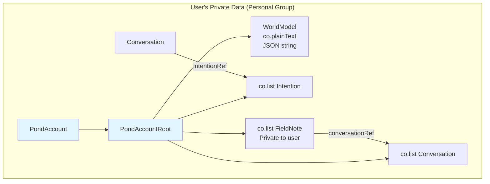
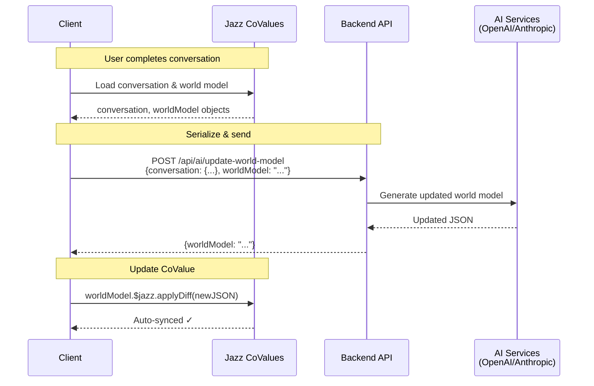

# Jazz Integration Specification for Pond

**Version:** 1.0  
**Date:** 2025-11-01  
**Status:** Planning

---

## Overview

This specification details the integration of Jazz Tools into Pond, establishing a local-first, privacy-preserving data architecture for user intentions, AI-powered conversations with Innio, and contemplative multiplayer features.

### Core Principles

1. **Privacy by Default**: All personal data (intentions, conversations, world models, field notes) stored in user's private Jazz CoValues
2. **Local-First Architecture**: Data lives on-device; AI services process but don't persist
3. **Selective Multiplayer**: Public space for Innio's reflections, maintaining calm & compassionate atmosphere
4. **Pragmatic Backend Pattern**: Initially using REST API pattern (client serializes CoValues → backend AI services → client writes back)

---

## Data Model

### Schema Definitions

Based on Jazz playbook patterns [[jazz-playbook.md]], all schemas use `co.*` and `z.*` composition:

```ts
import { co, z } from "jazz-tools";

// ============================================================================
// PRIVATE USER DATA (Owned by User's Personal Group)
// ============================================================================

/**
 * Intention - A user's goal or practice they're working with Innio to achieve
 * Can have multiple conversations across different stages
 */
export const Intention = co.map({
  title: z.string(),
  description: z.string().optional(),
  status: z.enum(["todo", "active", "completed", "archived"]),
  createdAt: z.number(), // Unix timestamp
  updatedAt: z.number(), // Unix timestamp
  timerDuration: z.number().optional(), // Minutes, if user sets a timer
  notes: z.string().optional(), // User's personal notes
});

export type Intention = co.loaded<typeof Intention>;

/**
 * Conversation - A voice interaction with Innio via ElevenLabs
 * Structure based on ElevenLabs conversation API response
 * Reference: https://github.com/elevenlabs/elevenlabs-js
 */
export const ConversationMessage = co.map({
  role: z.enum(["user", "agent"]),
  content: z.string(),
  timestamp: z.number(), // Unix timestamp
});

export const Conversation = co.map({
  // ElevenLabs conversation metadata
  elevenLabsId: z.string(), // conversation_id from ElevenLabs
  agentId: z.string(),
  startTime: z.number(), // Unix timestamp
  endTime: z.number().optional(), // Unix timestamp
  callSuccessful: z.boolean().optional(),
  summary: z.string().optional(), // AI-generated summary from ElevenLabs
  
  // Pond-specific data
  intentionRef: co.optional(Intention), // Reference to associated intention (if any)
  messages: co.list(ConversationMessage), // Transcript
  userReflection: z.string().optional(), // User's post-conversation notes
  
  // Metadata
  createdAt: z.number(), // Unix timestamp
});

export type Conversation = co.loaded<typeof Conversation>;

/**
 * FieldNote - Innio's private observations about the user
 * Generated by AI after conversations, stored privately for personalization
 */
export const FieldNote = co.map({
  content: z.string(), // Innio's reflection/observation
  conversationRef: co.optional(Conversation), // Optional link to conversation that inspired it
  createdAt: z.number(), // Unix timestamp
  tags: co.list(z.string()), // Categories: e.g., ["insight", "pattern", "question"]
});

export type FieldNote = co.loaded<typeof FieldNote>;

/**
 * UserProfile - Extended profile beyond Jazz's default
 */
export const UserProfile = co.map({
  name: z.string(),
  timezone: z.string().optional(),
  preferredSessionDuration: z.number().optional(), // Minutes
});

export type UserProfile = co.loaded<typeof UserProfile>;

/**
 * PondAccountRoot - Private root for each user
 * All data here is private by default (owned by user's personal group)
 */
export const PondAccountRoot = co.map({
  // Core data collections
  intentions: co.list(Intention),
  conversations: co.list(Conversation),
  fieldNotes: co.list(FieldNote), // Innio's private notes about this user
  
  // AI-generated state (stored as JSON strings, updated atomically)
  worldModel: co.plainText(), // JSON: user's inferred values, beliefs, fears, memories, relationships
  
  // Settings
  profile: UserProfile,
});

export type PondAccountRoot = co.loaded<typeof PondAccountRoot>;

/**
 * PondAccount - Main account schema
 * Per Jazz patterns, includes migration for initialization
 */
export const PondAccount = co.account({
  root: PondAccountRoot,
  profile: co.profile(), // Jazz's built-in profile (name, avatar)
})
.withMigration((account) => {
  // Initialize root on first account creation
  if (!account.$jazz.has("root")) {
    account.$jazz.set("root", {
      intentions: co.list(Intention).create([]),
      conversations: co.list(Conversation).create([]),
      fieldNotes: co.list(FieldNote).create([]),
      worldModel: co.plainText().create(JSON.stringify({
        version: 1,
        created: Date.now(),
        values: [],
        personality: {},
        fears: [],
        beliefs: [],
        memories: [],
        relationships: [],
      })),
      profile: UserProfile.create({
        name: "",
        timezone: Intl.DateTimeFormat().resolvedOptions().timeZone,
      }),
    });
  }
});

export type PondAccount = co.loaded<typeof PondAccount>;

// ============================================================================
// MULTIPLAYER (Future Implementation)
// ============================================================================

// STUB: Innio's Global Field Notes
// TODO: Implement when adding multiplayer features
// - Server Worker posts daily reflections
// - Public readable, authenticated users can react/comment
// export const GlobalFieldNote = co.map({ ... });
// export const GlobalFieldNotesFeed = co.list(GlobalFieldNote);

// STUB: Public Intentions Feed
// TODO: Implement when adding multiplayer features
// - Users can opt-in to share anonymized intentions
// - Public readable, authenticated users can react
// export const AnonymizedIntention = co.map({ ... });
// export const PublicIntentionsFeed = co.feed(AnonymizedIntention);

// STUB: Real-time Presence
// TODO: Implement when adding multiplayer features
// - Show count of active users in reflective states
// export const Presence = co.map({ ... });
// export const PresenceFeed = co.list(Presence);
```

---

## Group Ownership & Permissions

Per Jazz playbook [[jazz-playbook.md]], permissions are managed through Groups, not custom ACLs.

### Private User Data

**Pattern**: User's personal Group owns all private CoValues

```ts
// During account creation (in migration)
const userPersonalGroup = Group.create(); // Automatically created by Jazz for account
const intention = Intention.create({ 
  title: "Meditate daily",
  status: "active",
  createdAt: Date.now(),
  updatedAt: Date.now(),
}, userPersonalGroup);

me.root.intentions.$jazz.push(intention);
```

**Access**: Only the user can read/write their intentions, conversations, field notes, and world model.

### Multiplayer Stubs (Future)

**Innio's Global Field Notes**: Server Worker posts daily reflections, publicly readable

**Public Intentions Feed**: Users opt-in to share anonymized intentions

**Real-time Presence**: Show count of users in reflective states

Implementation deferred to later phase.

---

## Data Relationships



### Key Reference Patterns

Per Jazz playbook (lines 650-676) [[jazz-playbook.md]], direct CoValue references are correct:

```ts
// ✅ Correct: Direct CoValue reference
const Conversation = co.map({
  intentionRef: co.optional(Intention),
  // ...
});

// When creating:
const conversation = Conversation.create({
  intentionRef: existingIntention, // Jazz handles group permissions
  // ...
}, userGroup);
```

Jazz automatically ensures the Conversation's owner group can access the referenced Intention through group cascading.

---

## Backend Architecture

### Pragmatic Pattern (Non-Idiomatic but Simple)

**Flow**: Client loads CoValues → Serializes to JSON → Sends to REST API → Backend calls AI → Returns JSON → Client updates CoValues

This breaks Jazz's recommended patterns (Server Worker should load CoValues directly), but provides simpler initial implementation.



**Rationale**:
- Simpler backend: No need for Server Worker credentials in every API route
- Faster iteration: JSON in/out is familiar REST pattern
- Privacy preserved: AI services process but don't store; data returns to CoValues
- Migration path: Can refactor to idiomatic JazzRPC later if needed

### HTTP Client

All API requests use axios:

```ts
import axios from 'axios';

const api = axios.create({
  baseURL: import.meta.env.VITE_API_URL || 'http://localhost:3000',
  headers: { 'Content-Type': 'application/json' },
});
```

---

## API Endpoints

### ElevenLabs Integration

#### `POST /api/elevenlabs/signed-url`

**Purpose**: Generate signed URL for client to initiate voice call with Innio

**Request**:
```json
{
  "userId": "string",
  "agentId": "string",
  "userName": "string"
}
```

**Response**:
```json
{
  "conversationId": "conv-xyz123",
  "signedUrl": "https://elevenlabs.io/api/v1/conversations/conv-xyz123/start?token=...",
  "expiresAt": 1234567890
}
```

**Client Usage**:
```ts
import axios from 'axios';

// STUB: ElevenLabs voice call flow
// TODO: Implement full flow when integrating voice calls
const { data } = await axios.post('/api/elevenlabs/signed-url', {
  userId: me.$jazz.id,
  agentId: import.meta.env.VITE_ELEVENLABS_AGENT_ID,
  userName: me.profile.name,
});

// Use signedUrl to open ElevenLabs interface
// After call, retrieve conversation data and create Conversation CoValue
```

### AI Processing

#### `POST /api/ai/update-world-model`

**Purpose**: Generate updated world model based on latest conversation

**Request**:
```json
{
  "currentWorldModel": "{\"version\":1,\"values\":[],\"personality\":{}}",
  "conversation": {
    "summary": "User wants to meditate daily",
    "messages": [
      { "role": "user", "content": "..." },
      { "role": "agent", "content": "..." }
    ]
  },
  "userContext": {
    "previousIntentions": ["Exercise weekly", "Read more books"],
    "completedIntentions": 2,
    "totalConversations": 5
  }
}
```

**Response**:
```json
{
  "worldModel": "{\"version\":2,\"values\":[\"mindfulness\",\"consistency\"],\"personality\":{\"openness\":0.8},\"beliefs\":[\"Meditation brings clarity\"],\"patterns\":[\"Sets morning routines\"]}",
  "updatedAt": 1234567890
}
```

**Client Usage**:
```ts
import axios from 'axios';

// After conversation is saved
const { data } = await axios.post('/api/ai/update-world-model', {
  currentWorldModel: me.root.worldModel.toString(),
  conversation: {
    summary: newConversation.summary,
    messages: newConversation.messages.map(m => ({ 
      role: m.role, 
      content: m.content 
    })),
  },
  userContext: {
    previousIntentions: me.root.intentions.map(i => i.title),
    completedIntentions: me.root.intentions.filter(i => i.status === "completed").length,
    totalConversations: me.root.conversations.length,
  },
});

// Update CoValue
me.root.worldModel.$jazz.applyDiff(data.worldModel);
```

#### `POST /api/ai/generate-field-note`

**Purpose**: Generate private field note (Innio's observation about user)

**Request**:
```json
{
  "conversation": {
    "summary": "...",
    "messages": [...]
  },
  "worldModel": "{...}",
  "recentFieldNotes": ["Previous note 1", "Previous note 2"]
}
```

**Response**:
```json
{
  "content": "This person is developing a consistent mindfulness practice. They seem to value structure and respond well to gentle encouragement.",
  "tags": ["insight", "pattern"],
  "createdAt": 1234567890
}
```

**Client Usage**:
```ts
import axios from 'axios';

const { data } = await axios.post('/api/ai/generate-field-note', {
  conversation: {
    summary: newConversation.summary,
    messages: newConversation.messages.map(m => ({
      role: m.role,
      content: m.content
    })),
  },
  worldModel: me.root.worldModel.toString(),
  recentFieldNotes: me.root.fieldNotes.slice(-5).map(fn => fn.content),
});

const fieldNote = FieldNote.create({
  content: data.content,
  conversationRef: newConversation,
  createdAt: data.createdAt,
  tags: co.list(z.string()).create(data.tags, userGroup),
}, userGroup);

me.root.fieldNotes.$jazz.push(fieldNote);
```

---

## Client Integration Patterns

### Provider Setup

```tsx
// src/main.tsx
import { JazzReactProvider } from "jazz-tools/react";
import { PondAccount } from "./schema";

const JAZZ_PEER = import.meta.env.VITE_JAZZ_SYNC_PEER;

function App() {
  return (
    <JazzReactProvider
      sync={{ 
        peer: JAZZ_PEER,
        when: "always"
      }}
      AccountSchema={PondAccount}
    >
      <PondApp />
    </JazzReactProvider>
  );
}
```

### Using Private Data

Per Jazz playbook [[jazz-playbook.md]], always use tri-state guards (undefined/null/loaded):

```tsx
// Example: Working with intentions
import { useAccount } from "jazz-tools/react";
import { PondAccount } from "../schema";

export function IntentionsList() {
  const { me } = useAccount(PondAccount, {
    resolve: { 
      root: { 
        intentions: { $each: true } 
      } 
    }
  });
  
  // Tri-state guards (Jazz playbook requirement)
  if (me === undefined) return <div>Loading...</div>;
  if (me === null) return <div>Please sign in</div>;
  
  return (
    <ul>
      {me.root.intentions.map(intention => (
        <li key={intention.$jazz.id}>
          {intention.title} - {intention.status}
        </li>
      ))}
    </ul>
  );
}
```

### Creating New Intention

```tsx
import { useAccount } from "jazz-tools/react";
import { PondAccount, Intention } from "../schema";

export function createIntention(me: PondAccount, title: string) {
  const intention = Intention.create({
    title,
    status: "todo",
    createdAt: Date.now(),
    updatedAt: Date.now(),
  }, me.root.$jazz.owner);
  
  me.root.intentions.$jazz.push(intention);
  return intention;
}
```

---

## Implementation Phases

### Phase 1: Authentication & Setup (Week 1)

- [ ] Install Jazz dependencies (`jazz-tools`)
- [ ] Set up Jazz provider with sync peer
- [ ] Implement authentication (passkey or passphrase)
- [ ] Create PondAccount schema with root initialization
- [ ] Test authentication flow

### Phase 2: Core Data Model (Week 2-3)

- [ ] Implement Intention schema and CRUD operations
- [ ] Implement Conversation schema (basic structure)
- [ ] Implement World Model (co.plainText with JSON)
- [ ] Implement Private Field Notes schema
- [ ] Test data creation, updating, syncing

### Phase 3: ElevenLabs Integration (Week 4-5)

- [ ] Backend API: `/api/elevenlabs/signed-url`
- [ ] Client: Request signed URL and initiate call
- [ ] Client: Create Conversation CoValue from call data
- [ ] Test voice call flow (stub for now)

### Phase 4: AI Processing (Week 6-7)

- [ ] Backend API: `/api/ai/update-world-model`
- [ ] Backend API: `/api/ai/generate-field-note`
- [ ] Client: Trigger AI processing after conversations
- [ ] Client: Update world model and field notes CoValues

### Phase 5: Multiplayer Features (Future)

- [ ] Innio's global field notes (stub)
- [ ] Public intentions feed (stub)
- [ ] Real-time presence (stub)


---

## Environment Variables

```bash
# .env.local (client)
VITE_JAZZ_SYNC_PEER=wss://cloud.jazz.tools/?key=YOUR_API_KEY
VITE_ELEVENLABS_AGENT_ID=agent_xyz123
VITE_API_URL=http://localhost:3000

# .env (server)
ELEVENLABS_API_KEY=sk_elevenlabs_...
ANTHROPIC_API_KEY=sk-ant-...
OPENAI_API_KEY=sk-...
```

---

## References

- **Jazz Playbook**: `/docs/jazz-playbook.md` [[jazz-playbook.md]]
- **ElevenLabs Docs**: https://github.com/elevenlabs/elevenlabs-js
- **Jazz Inspector**: https://inspector.jazz.tools (for debugging CoValues)
- **Jazz Cloud**: https://dashboard.jazz.tools (sync server management)

---

## Questions & Decisions Log

1. **Q**: Should we use JazzRPC or REST for AI endpoints?  
   **A**: REST initially for simplicity; can migrate to JazzRPC in Phase 5+

2. **Q**: How to handle ElevenLabs webhook data delivery to client?  
   **A**: Temporary backend cache + polling; explore WebSocket/SSE later

3. **Q**: Multiplayer pattern: public intentions vs. Innio's reflections?  
   **A**: Innio's public field notes (better fit for contemplative space)

4. **Q**: CoValue reference pattern: is `intentionRef: Intention` correct?  
   **A**: Yes, confirmed per Jazz playbook (lines 650-676)

5. **Q**: How to handle emoji reactions (individual tracking vs. aggregation)?  
   **A**: Aggregate ReactionCount (emoji + count) managed by server worker

---

## Next Steps

1. **Review & Refine**: Team reviews this spec, identifies gaps/questions
2. **Schema Prototyping**: Create schemas in `src/schema.ts`, test with Jazz Inspector
3. **Backend Scaffolding**: Set up API routes structure
4. **Client Integration**: Wire up Jazz provider, test authentication
5. **Iteration**: Build incrementally per phases, validate with users

---

**End of Specification**

