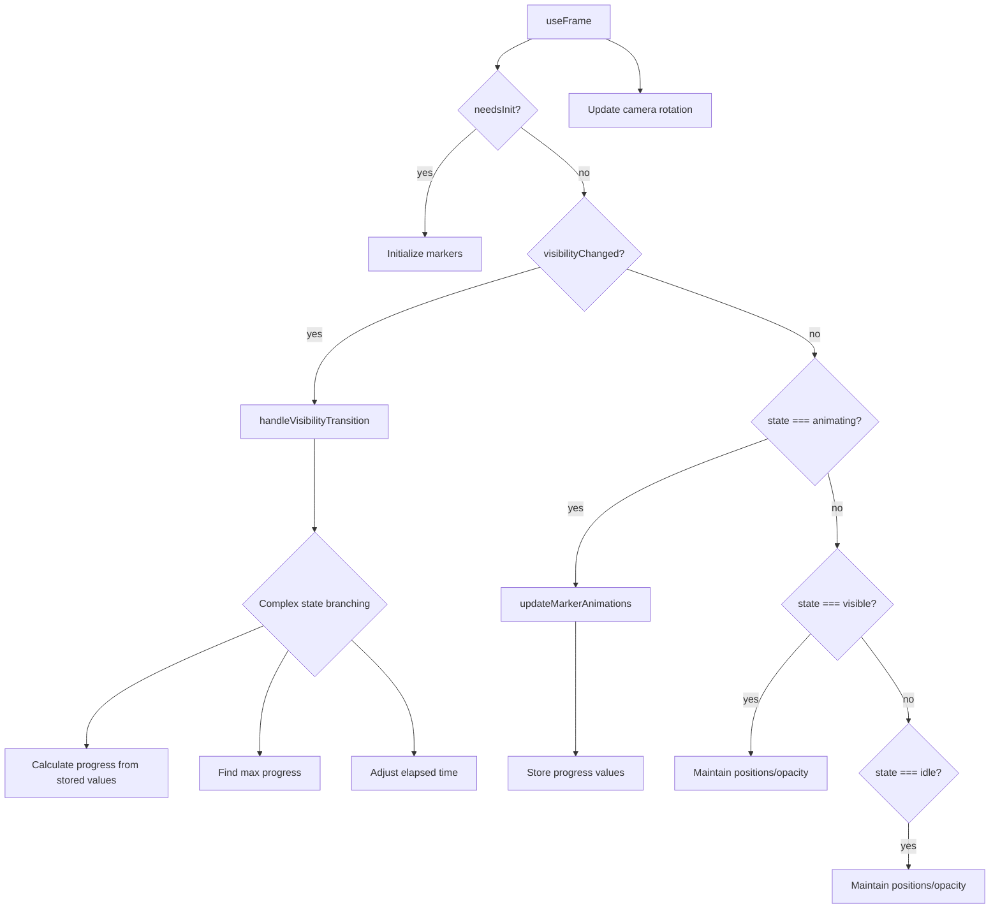
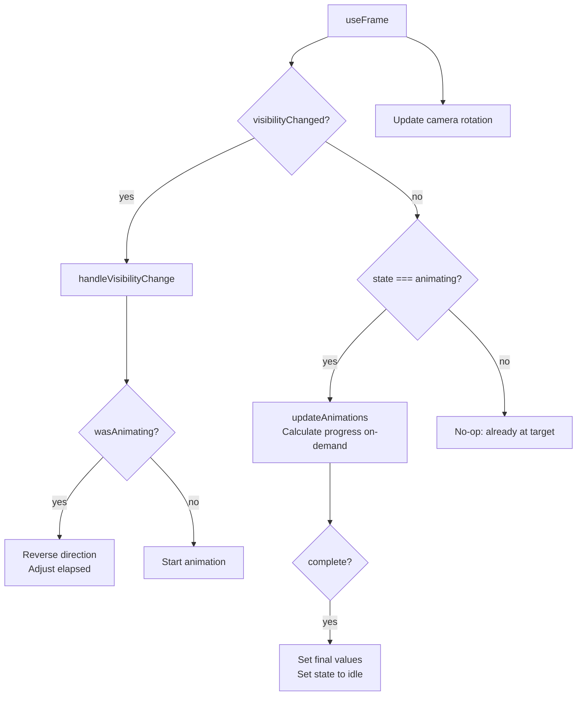

# RadialMarkers Animation System Simplification Plan

## Current Issues

1. **Redundant State Maintenance** (lines 298-325): After animation completes, code "maintains" positions/opacity that are already set. This is unnecessary defensive code.

2. **Complex Interrupt Logic** (lines 195-265): Repeated max-finding loops, complex conditional branches. Can be unified.

3. **Redundant Progress Storage** (line 163): `markerProgress.current` is stored but only used for interrupts. During normal animation, progress is recalculated every frame anyway.

4. **Over-complicated State Tracking**: `pendingVisibilityRef` stores `{from, to}` when we already have `prevIsVisible.current`.

5. **Terminal States Unnecessary**: 'visible' and 'idle' states don't need special handling - they're just "not animating".

## Simplified Architecture

### Core Principle
**Unified animation loop**: Always animate toward `isVisible` target. No separate state maintenance needed.

### Key Simplifications

1. **Single Direction State**
   - Instead of: `'idle' | 'entering' | 'visible' | 'exiting'`
   - Use: `'animating' | 'idle'` + `targetVisible: boolean`
   - Or even simpler: Just track `isAnimating` and direction

2. **Progress Calculation**
   - Remove `markerProgress` storage during animation
   - Only calculate during interrupts (when needed)
   - During normal animation, calculate on-demand

3. **Interrupt Handling**
   - Extract max-finding to single helper
   - Use inverse calculation: `elapsed = startTime + progress * duration`
   - Simplify to single code path

4. **State Maintenance**
   - Remove maintenance loops entirely
   - Animation completion already sets final values
   - If something drifts, we'll detect it next frame naturally

5. **Initialization**
   - Simplify: Set initial state in `useEffect`, let first frame handle refs

## Proposed Code Structure

```typescript
// Simplified state
type Direction = 'entering' | 'exiting'
const isAnimating = animationState.current === 'entering' || animationState.current === 'exiting'

// Unified animation function
function updateAnimations(delta: number) {
  if (isAnimating) {
    // Update all markers
    // Calculate progress on-demand (no storage)
    // Handle completion -> set state to terminal
  }
}

// Simplified interrupt
function handleVisibilityChange() {
  if (currentState === 'animating') {
    // Calculate current progress from elapsed time
    // Reverse direction
    // Adjust elapsed time to match current progress
  } else {
    // Start fresh animation
  }
}

// No maintenance loops - completion already set everything
```

## Detailed Simplifications

### 1. State Machine Reduction

**Current** (4 states):
```typescript
type AnimationState = 'idle' | 'entering' | 'visible' | 'exiting'
```

**Simplified** (2 states + direction):
```typescript
type AnimationState = 'idle' | 'animating'
const targetVisible = useRef<boolean>(false) // Direction inferred from target
```

**Why**: 'visible' and 'idle' are terminal states with no animation logic. We can compute them from `isVisible` prop.

### 2. Remove State Maintenance Loops

**Current** (lines 298-325):
- Separate loops for 'visible' and 'idle' states
- "Ensures" positions/opacity stay correct
- Runs every frame even when nothing changes

**Simplified**:
- Remove entirely
- Animation completion (lines 112-142) already sets final values correctly
- If something drifts, next visibility change will correct it

**Savings**: ~30 lines per frame of unnecessary work

### 3. Progress Storage Simplification

**Current**:
- `markerProgress.current[i]` stored every frame (line 163)
- Only used during interrupts (lines 217-218, 242-243)
- Recalculated from elapsed time anyway during animation

**Simplified**:
- Calculate progress on-demand during interrupts only
- During normal animation, calculate directly from `elapsed` time
- No storage needed

**Helper function**:
```typescript
function getMarkerProgress(i: number, elapsed: number, isEntering: boolean): number {
  const startTime = isEntering ? i * staggerDelay : (count - 1 - i) * staggerDelay
  return calculateProgress(elapsed, startTime, animationDuration, isEntering)
}
```

### 4. Unified Interrupt Logic

**Current**: 
- Separate branches for 'idle'→'entering', 'exiting'→'entering', 'entering'→'exiting', 'visible'→'exiting'
- Repeated max-finding loops
- Complex elapsed time calculations

**Simplified**:
```typescript
function handleVisibilityChange(targetVisible: boolean) {
  const wasAnimating = animationState.current === 'animating'
  const wasEntering = targetVisibleRef.current === true
  
  if (!wasAnimating) {
    // Start fresh
    animationState.current = 'animating'
    animationElapsedRef.current = 0
    targetVisibleRef.current = targetVisible
  } else if (wasEntering !== targetVisible) {
    // Reverse mid-animation
    // Calculate current progress from elapsed time
    // Invert direction and adjust elapsed time
  }
}
```

**Helper for interrupt calculation**:
```typescript
function calculateElapsedFromProgress(progress: number, markerIndex: number, isEntering: boolean): number {
  const startTime = isEntering ? markerIndex * staggerDelay : (count - 1 - markerIndex) * staggerDelay
  return startTime + progress * animationDuration
}
```

### 5. Simplified Initialization

**Current**:
- Deferred initialization flag
- Separate loop in useFrame
- Extra ref tracking

**Simplified**:
- Set initial state in `useEffect`
- Only defer ref access if refs not ready (single check)

### 6. Reduce Ref Count

**Current refs**: 11
- `groupRef`, `currentQuaternion`, `targetQuaternion`, `targetMatrix`
- `animationState`, `markerProgress`, `markerPositions`, `markerRefs`, `markerMaterials`
- `prevIsVisible`, `needsInitialization`, `visibilityChangedRef`, `pendingVisibilityRef`
- `noiseTimeRef`, `animationElapsedRef`
- `tempPos`, `groupWorldPos`, `direction` (useMemo)

**Simplified refs**: 9
- Remove `pendingVisibilityRef` (use `prevIsVisible` + flag)
- Remove `markerProgress` (calculate on-demand)
- Remove `needsInitialization` (check refs directly)
- Keep rest for functionality

## Flow Comparison

### Current Flow


### Simplified Flow


## Metrics

**Current**: ~366 lines
**Target**: ~200-220 lines  
**Reduction**: ~40-45% (146-166 lines removed)

**Line-by-line breakdown**:
- State maintenance loops: ~30 lines (298-325)
- Complex interrupt branching: ~70 lines (195-265) → ~30 lines simplified
- Redundant progress storage: ~5 lines (163, 207, 259, plus storage setup)
- Over-engineered transition tracking: ~10 lines (89-96, 287-290)
- Unnecessary initialization complexity: ~15 lines (272-284)
- Consolidation opportunities: ~20 lines (repeated patterns)

**Benefits**:
- ✅ Easier to understand: Single animation path
- ✅ Fewer edge cases: Unified interrupt handling
- ✅ Less code to maintain: ~40% reduction
- ✅ Better performance: No redundant work each frame
- ✅ Same functionality: All features preserved

